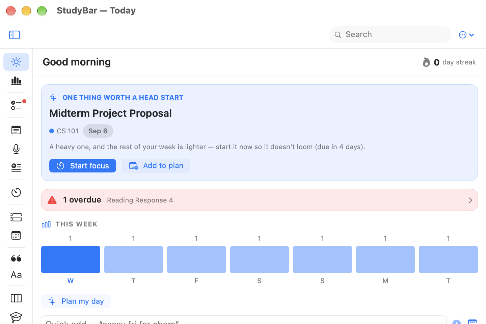
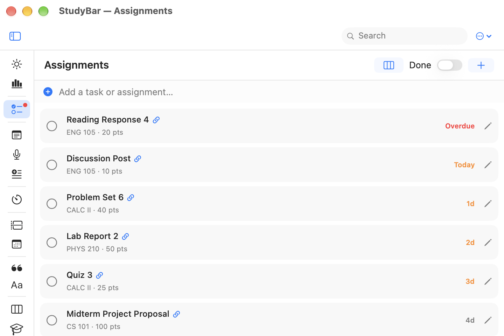
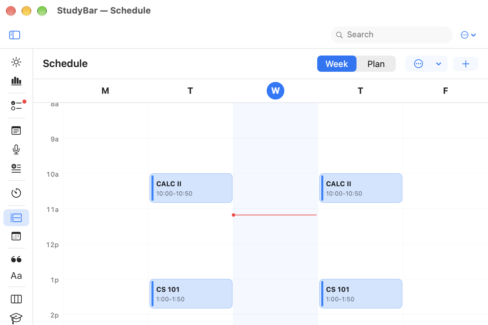
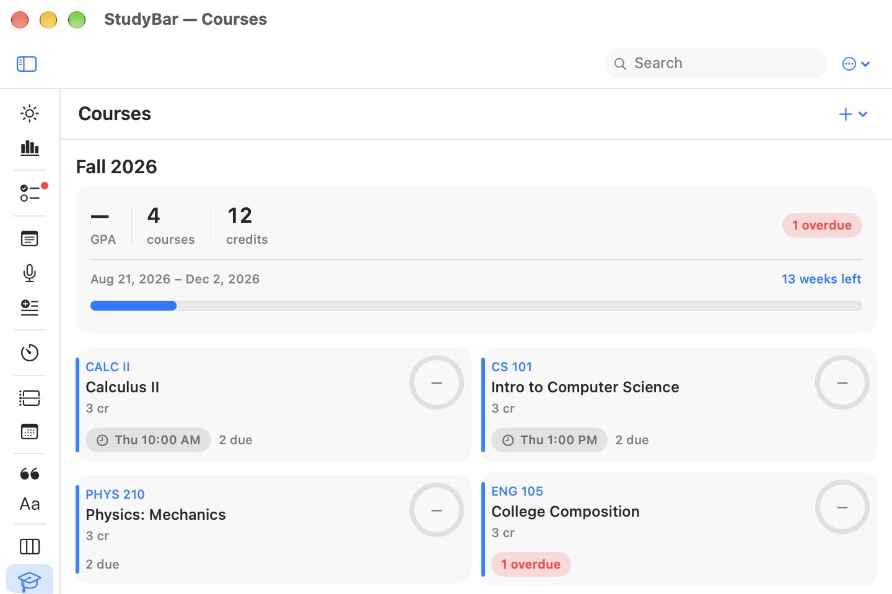

<div align="center">

# 🎓 StudyBar

**A free, open-source menu-bar study companion for macOS.**

Your whole study life one click away — assignments, notes, flashcards, focus timers,
schedule, and citations. Attach a PDF and **ask questions about your textbook**, or
summarize and rewrite right inside a note. AI that *organizes and answers from your own
material* — never does your homework. Local-first: no account, no paywall, no cloud required.

Native SwiftUI · macOS 14+ · single `.app` · MIT licensed

</div>

---

## Screenshots

<div align="center">

<table>
<tr>
<td width="50%"><br><em>Today — what deserves a head start, right now</em></td>
<td width="50%"><br><em>Assignments — due-sorted, color-coded</em></td>
</tr>
<tr>
<td width="50%"><br><em>Schedule — your week at a glance</em></td>
<td width="50%"><br><em>Courses — the whole term in one place</em></td>
</tr>
</table>

<sub>Sample data shown.</sub>

</div>

---

## Install

> **Heads up — the app isn't notarized.** Notarization needs a paid Apple Developer ID
> ($99/yr); this is a free project, so it's skipped. macOS therefore shows a
> "can't be checked for malicious software" warning on first launch. It's a one-time
> step to get past it, whichever way you install.

### Homebrew

```bash
brew install --cask --no-quarantine hqn07/studybar/studybar
```

The `--no-quarantine` flag skips the Gatekeeper warning entirely. Without it, install
still works — you'll just do the one-time right-click → Open below.

### Download

Grab the `.dmg` from the [latest release](https://github.com/hqn07/studybar/releases/latest),
open it, and drag **StudyBar** to Applications. Then, once:

- **right-click the app → Open** (and confirm), or
- ```bash
  xattr -dr com.apple.quarantine /Applications/StudyBar.app
  ```

### Build from source

```bash
brew install xcodegen        # one-time
git clone https://github.com/hqn07/studybar.git && cd studybar
./scripts/run.sh             # build + install to /Applications + launch
```

Look for the graduation-cap in your menu bar. **Left-click** for the popover,
**right-click** for a quick menu, or press **⌘O** for a resizable window.

---

## What's inside

A focused set of modules across study, capture, focus, schedule, research and
organization — everything hangs off your **Courses**.

- **Overview** — Today (AI-ranked next-up, streak, due-today, natural-language quick-add, **Plan my day** — propose→accept study blocks) · Insights (7-day chart, time by course, flashcard retention).
- **Assignments** — due countdowns, checklists, recurring, notifications with Complete/Snooze, AI urgency ranking, and **AI "break into steps."**
- **Notes** — a real Markdown editor (slash menu, tables, checklists, native LaTeX, `[[wikilinks]]` + backlinks, templates) with inline **✨ AI** to summarize / rewrite / proofread.
- **Voice Note** — on-device transcription (Apple Speech live, or Whisper) with crash-safe autosave.
- **Flashcards** — FSRS scheduling, cloze, match & test modes, **Anki `.apkg`/CSV import & export**, and **AI card generation** from your own material.
- **Reading** — track books, chapters, highlights — and **attach a PDF to search inside it and ask questions answered from the actual pages, with citations** (on-device; OCR for scanned PDFs).
- **Time & Focus** — Pomodoro (course-linked) · Stopwatch · Focus (hide apps + ambient noise) · Time blocking.
- **Schedule** — weekly timetable with due-markers & exam banners · **tap any day to plan it** (AI study blocks for that date) · import classes from an **`.ics` feed or pasted text** · unified Calendar (EventKit + iCal feeds + assignments).
- **Research & Library** — Citations (APA/MLA/Chicago/IEEE/Harvard/Vancouver/BibTeX) · Reading List · Files · **News** (RSS/Atom reader).
- **Organize** — Kanban board · Courses + grades.

### AI — a material, not a place

AI is woven into the surfaces you already use, not a chatbot you visit. It **organizes and
answers from *your* material — it won't write your homework.**

- **Inline (✨)** on any text — summarize, rewrite, proofread, continue. You **accept or discard**; nothing is auto-applied.
- **Ask your textbook** — attach a PDF and get retrieval-augmented Q&A over the relevant pages, **with citations** (the model never sees the whole book, so it fits any engine).
- **Command bar (⌘K)** — cross-note jobs proposed as confirm-cards.
- **Break into steps**, **flashcards from a note**, **AI-organize a transcript** — structured actions, always propose-then-accept.

Runs on **Apple's on-device model** (macOS 26, free & private), **Ollama** (free local models — `qwen2.5:7b` recommended), or your own **Claude / ChatGPT** key (stored in the Keychain). On-device and Ollama send nothing off your Mac.

### System integration

Global hotkeys · floating command palette · quick-capture panel · `studybar://` URL
scheme · Services menu · Shortcuts.app actions · Reminders push · **Canvas import via
calendar feed (no API token)** · undo for deletes · Spotlight indexing · Focus/DND
automation · daily backups · optional iCloud Drive sync.

---

## Privacy

Local-first by design. Your data is a single JSON file on your Mac
(`~/Library/Application Support/StudyBar/data.json`, or iCloud Drive if you enable sync).
No telemetry, no analytics, no account.

Network is used **only** for features you opt into: Canvas sync, the Lookup/News feeds,
auto-fetching book covers and link titles, and cloud AI **if** you choose Claude/ChatGPT.
The on-device and Ollama AI engines send nothing off your Mac.

---

## Architecture

- `Core/` — data models, JSON store, engines & services (Pomodoro, AI, Canvas, RSS, Spotlight, …), module registry.
- `Shell/` — menu-bar status item, root split view, command palette, shared components.
- `Modules/` — one file per feature. Add a module = a view + a line in `Core/ModuleRegistry.swift`.

The menu-bar popover auto-dismisses on focus loss, so there are **no** sheets/alerts —
editors push inline and confirmations are in-popover overlay cards.

```bash
./scripts/run.sh            # build (Debug) + install + relaunch
./scripts/run.sh release    # optimized
./scripts/package.sh        # dist/StudyBar-x.y.z.dmg + Homebrew cask
```

---

## Feedback & contributing

StudyBar is built in the open — feedback shapes it.

- **✉️ Feedback? Email is best: [unrest.green_6d@icloud.com](mailto:unrest.green_6d@icloud.com)** — it gets the fastest reply. (Heads-up: I don't check GitHub often, so email beats an issue for anything you want a response to.) There's also a one-click **Send feedback by email** in Settings ▸ About.
- **🐞 Bug?** Email works, or [open an issue](https://github.com/hqn07/studybar/issues/new/choose) (there's a template) — include your macOS version and steps to reproduce. Even easier: **Settings ▸ Diagnostics ▸ Send by email** attaches a privacy-safe report (version, engine state, recent technical events — never your note or transcript text).
- **💡 Ideas / questions / show & tell?** [Discussions](https://github.com/hqn07/studybar/discussions).

Pull requests are welcome — a module is just a view plus a line in `Core/ModuleRegistry.swift`.
For anything large, email first so we can align (GitHub is checked infrequently).

---

## License

[MIT](LICENSE) © 2026 hqn07. Free to use, modify and share.
